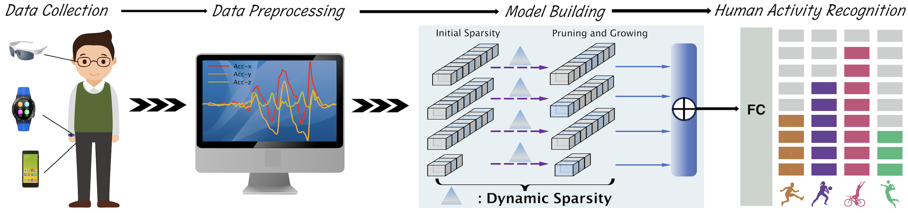
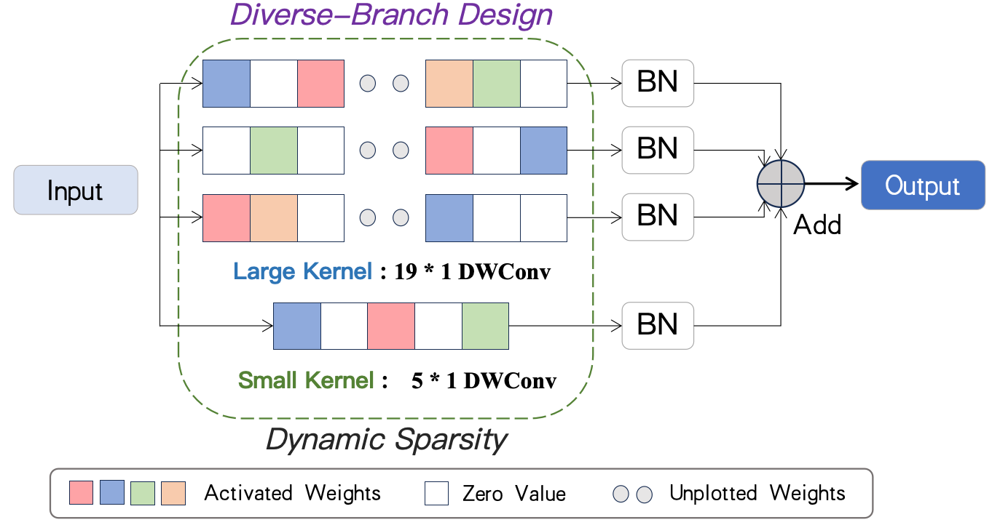

# SLK-HAR

[](https://github.com/MinghuiYao/SLK-HAR/actions/workflows/ci.yml)
[](https://www.python.org/)
[](https://pytorch.org/)

Reference implementation of **A Sparse Diverse-Branch Large Kernel
Convolutional Neural Network for Human Activity Recognition Using Wearables**.





SLK-HAR combines parallel grouped large-kernel branches, a local branch,
residual learning, and dynamic sparse masks. The maintained artifact removes
undeclared runtime dependencies and provides a compact tested sparsity core.

## Installation

```bash
git clone https://github.com/MinghuiYao/SLK-HAR.git
cd SLK-HAR
python -m pip install -e .
```

## Quick start

```python
import torch
from slk_har import SLKNet

model = SLKNet(input_shape=(1, 128, 9), num_classes=6)
logits = model(torch.randn(8, 1, 128, 9))
print(logits.shape)  # torch.Size([8, 6])
```

Input order is `[batch, channel, time, modalities]`. Run
`python examples/quickstart.py` for a forward/backward smoke test.

## Dynamic sparsity

```python
from slk_har import Masking

optimizer = torch.optim.SGD(model.parameters(), lr=0.01, momentum=0.9)
masking = Masking(
    optimizer,
    density=0.6,
    prune_rate=0.1,
    update_frequency=100,
    growth_mode="gradient",
)
masking.add_module(model)

# After loss.backward(), replaces optimizer.step():
masking.step()
```

Bias and batch-normalization vectors remain dense. Supported core modes are
magnitude pruning with random, gradient, or momentum regrowth.

## Correctness notes

The original `SLK-Net.py` imported a nonexistent `sparse_core` module, while
`sparse.py` imported a nonexistent `funcs` module. Its regrowth helper also
hard-coded `cuda:1`, causing device mismatches on CPU, single-GPU, and other GPU
configurations. These imports and device assumptions are removed. Root-level
legacy modules remain as compatibility exports.

## Artifact scope

See [docs/reproducibility.md](docs/reproducibility.md) for experimental assets
that remain to be published, including dataset protocols, sparse schedules,
checkpoints, and result tables.

## Citation

```bibtex
@software{yao_slk_har_2024,
  author = {Yao, Minghui},
  title  = {A Sparse Diverse-Branch Large Kernel Convolutional Neural Network for Human Activity Recognition Using Wearables},
  year   = {2024},
  url    = {https://github.com/MinghuiYao/SLK-HAR}
}
```

## License status

No open-source license has been declared. Until the copyright holder adds one,
the repository does not grant general permission to copy, modify, or redistribute the code.
